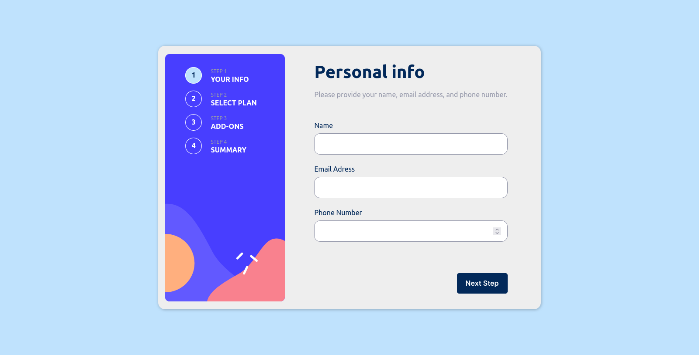
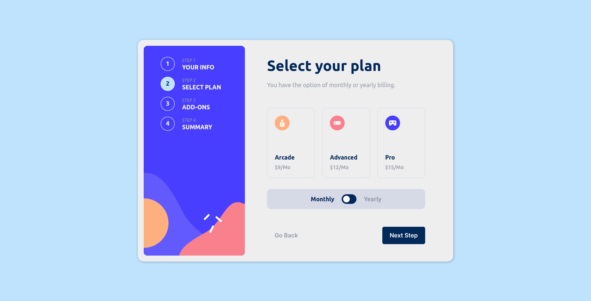
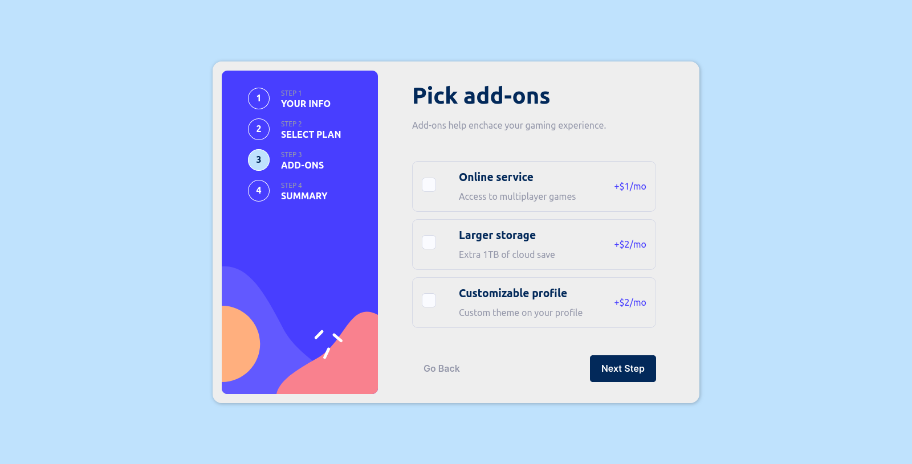
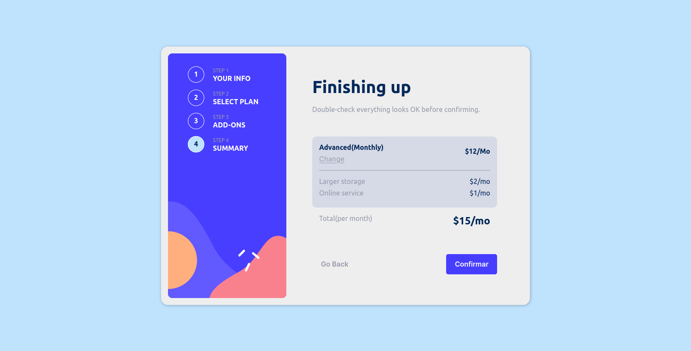
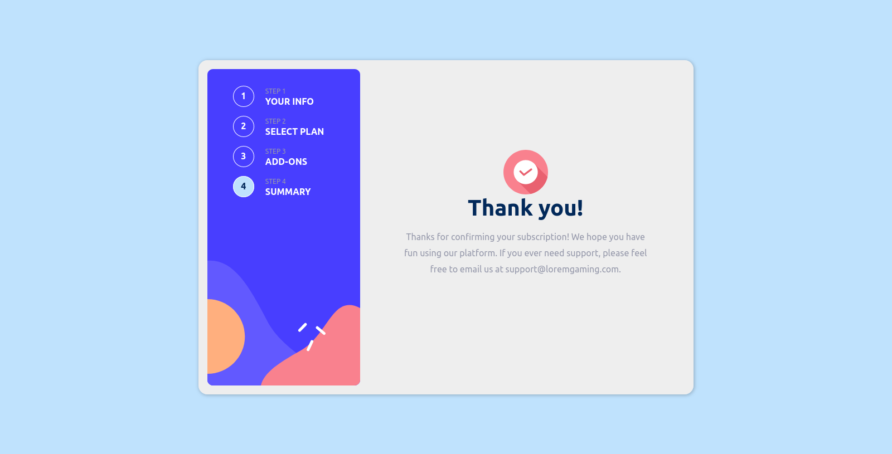

# Frontend Mentor - Multi-step form solution

This is a solution to the [Multi-step form challenge on Frontend Mentor](https://www.frontendmentor.io/challenges/multistep-form-YVAnSdqQBJ). Frontend Mentor challenges help you improve your coding skills by building realistic projects.

## Table of contents

- [Overview](#overview)
  - [The challenge](#the-challenge)
  - [Screenshot](#screenshot)
  - [Links](#links)
- [My process](#my-process)
  - [Built with](#built-with)
  - [What I learned](#what-i-learned)
  - [Continued development](#continued-development)
  - [Useful resources](#useful-resources)
- [Author](#author)

## Overview

In this challenge, I created a multi-step form using React. A multi-step form is a common user interface pattern used in various applications, including registration processes, surveys, and more. It breaks down a complex form into smaller, manageable sections, making it easier for users to provide information step by step.

### The challenge

Users should be able to:

- Complete each step of the sequence
- Go back to a previous step to update their selections
- See a summary of their selections on the final step and confirm their order
- View the optimal layout for the interface depending on their device's screen size
- See hover and focus states for all interactive elements on the page
- Receive form validation messages if:
  - A field has been missed
  - The email address is not formatted correctly
  - A step is submitted, but no selection has been made

### Screenshot

### Links

- Live Site URL: [https://multiformreact.vercel.app/](https://multiformreact.vercel.app/)

### Built with

- Semantic HTML5 markup
- CSS custom properties
- Flexbox
- CSS Grid
- Mobile-first workflow
- [React](https://reactjs.org/) - JS library

### What I learned

In this challenge, I significantly enhanced my skills in React and deepened my understanding of state management. Some of the key takeaways include:

React Componentization: I delved further into the concept of componentization in React. Breaking down the user interface into independent components resulted in cleaner and more maintainable code.

State Management: I grasped the crucial role of state management in React. Utilizing states allowed me to track and control dynamic changes in the user interface as users progressed through the multi-step form.

Form Validation: I implemented multi-step form validation logic, ensuring that user-provided data was accurate and met defined criteria.

Conditional Rendering: I enhanced my understanding of conditional rendering in React, enabling the display or concealment of components based on user actions.

User Experience (UX): I recognized the significance of creating a seamless and intuitive user experience by breaking down a complex process into simpler steps. This enhances usability and user satisfaction.

Troubleshooting: I gained experience in identifying and addressing React-related issues, such as syntax errors, business logic, and data flow.

These lessons have strengthened my abilities in React application development and have boosted my confidence in handling projects involving componentization, state management, and user interactions. I look forward to applying this knowledge in future projects and continuing to refine my skills in the exciting realm of React development.

### Continued development

I aspire to master React, delve into Next.js for efficient web app development, and explore Node.js for server-side capabilities. Real-world projects, open-source collaboration, and continuous learning will be my path to becoming a proficient and versatile web developer.

## Author

- LinkedIn - [Matheus Ramos](www.linkedin.com/in/matheus-r-d-s)
- Frontend Mentor - [@RDSMatheus](https://www.frontendmentor.io/profile/RDSMatheus)
- github - [@rdsmatheus](https://github.com/RDSMatheus)
